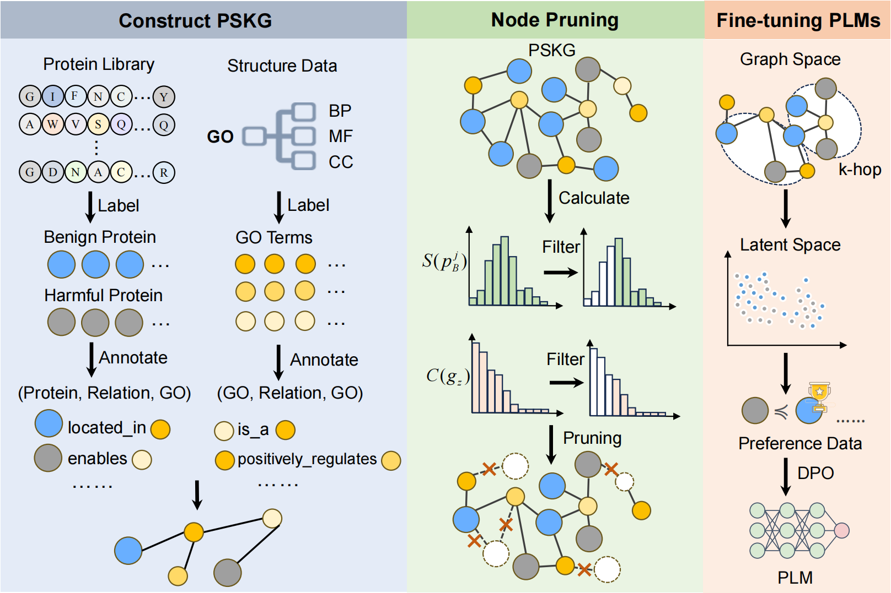

# Enhancing Safe and Controllable Protein Generation via Knowledge Preference Optimization

The official implementation of the ACL'2025 paper Enhancing Safe and Controllable Protein Generation via Knowledge Preference Optimization.

# Brief Introduction

Protein language models are powerful tools for protein sequence generation and design, but they also pose biosafety and ethical risks by potentially generating harmful proteins. This project introduces a Knowledge-guided Preference Optimization (KPO) framework that leverages a Protein Safety Knowledge Graph and reinforcement learning to guide sequence generation towards safer outcomes.



# Environments

To set up the environment for running KPO, use the command `pip install -r requirements.txt`. 

# Getting started

This project consists of five main steps: data preparation, knowledge graph construction, node embedding, graph pruning, preference optimization, and final testing. Please follow the instructions below to get started.

---

## Step 1: Data Preparation

1. **Download Raw Data**  
   Inspired by [OntoProtein](https://github.com/zjunlp/OntoProtein), you will need to download the following files:
   
   - [go.obo](https://geneontology.org/docs/download-ontology/) (Gene Ontology ontology file)
   - [uniprot_sprot.dat](https://www.uniprot.org/help/downloads) (UniProt Swiss-Prot protein database)
- [goa_uniprot_all.gaf](https://ftp.ebi.ac.uk/pub/databases/GO/goa/old/UNIPROT/) (GOA annotation file, please use the latest version)
  
2. **Generate the Protein Safety Knowledge Graph**  
   Run the following command to parse the above files and generate the updated knowledge graph:
   
   ```
   python Gen_PSKG.py
   ```

- **Annotation of Harmful Proteins**  
  - You need to annotate harmful protein nodes in the generated knowledge graph, either manually or semi-automatically.
  - **Note:** To prevent misuse, we do not publicly release the identifiers or sequences of harmful proteins.

---

### Step 2: Obtain Protein Node Embeddings

- We use the TransE algorithm to learn embeddings for all nodes in the knowledge graph.

- Run the following command to train and generate embeddings:

  ```
  python TransE.py
  ```

---

### Step 3: Knowledge Graph Pruning & Preference Pair Construction

- Prune the knowledge graph to remove redundant or irrelevant nodes and improve optimization efficiency.

- For detailed pruning methods, refer to Section 4.2 "Node Pruning with Weighted Metrics" in the paper.

- Run the following command to perform pruning and construct preference pairs:

  ```
  python Construct_Data_Prune.py
  ```

---

### Step 4: Knowledge-guided Preference Optimization of PLM

- Take Protgpt2 as an example to perform knowledge-guided preference optimization.

- Run the following command to start the optimization process:

  ```
  python KPO_Protgpt2.py
  ```

- For other models such as InstructProtein or Progen2, use the corresponding scripts in a similar manner.

---

### Step 5: Testing

1. **Generate Protein Sequences**  
 - Use both the original and optimized PLMs (e.g., Protgpt2) to generate 1000 protein sequences:
   ```
   python test_Protgpt2.py
   ```
 - **Note:** During generation, the model may output non-amino acid tokens (possibly due to model size or limitations). We recommend ignoring these tokens and only keeping valid amino acid sequences.

2. **Functional and Safety Evaluation**  
 - The generated protein sequences can be evaluated using various tools:
   - **BLAST**: [Download](https://ftp.ncbi.nlm.nih.gov/blast/executables/blast+/LATEST/)
   - **MMseq2**: [GitHub](https://github.com/soedinglab/MMseqs2)
   - **Toxinpred3**: [Online Tool](https://webs.iiitd.edu.in/raghava/toxinpred3/)
   - **HMMER**: [Download](http://hmmer.org/download.html)
   - **Pfam Database**: [Download](https://www.ebi.ac.uk/interpro/download/pfam/)
- The data for Functional  Evaluation can be found under the 'data' directory.


# Reference

If you use our repository, please cite the following related paper:

```
@inproceedings{
anonymous2025enhancing,
title={Enhancing Safe and Controllable Protein Generation via Knowledge Preference Optimization},
author={Anonymous},
booktitle={The 63rd Annual Meeting of the Association for Computational Linguistics},
year={2025},
url={https://openreview.net/forum?id=gydjrQqIue}
}
```